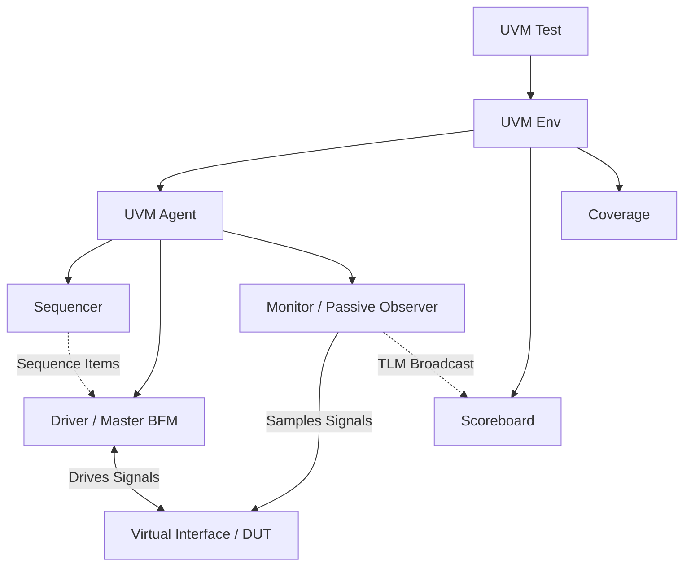

# AXI4-Lite UVM Testbench Flow: From Scratch

This document explains the architecture of the AXI4-Lite UVM Testbench, how a transaction flows from creation to verification, and exactly why we can now confidently trust that the "passes" are real and protocol-compliant.

## 1. The AXI4-Lite Protocol Basics
AXI4-Lite is a simplified version of the AXI protocol used for simple, low-throughput memory-mapped communication (like configuring registers). It consists of **5 independent channels**:
1. **Write Address (AW)**: Master sends the address it wants to write to.
2. **Write Data (W)**: Master sends the actual data.
3. **Write Response (B)**: Slave replies with a status code (e.g., `OKAY`).
4. **Read Address (AR)**: Master sends the address it wants to read from.
5. **Read Data (R)**: Slave replies with the data and a status code.

> [!IMPORTANT]
> **The Handshake Rule**: Every channel uses a `VALID` and `READY` signal. Information is only transferred when *both* `VALID` (sender is ready) and `READY` (receiver is ready) are `HIGH` on the rising edge of the clock. 

---

## 2. Testbench Architecture & Components

The UVM Testbench is an "Active Master" stimulating a "Passive Slave" (the RTL BFM). Here is the hierarchy:

---

## 3. The Lifecycle of a Transaction

Let's trace a **Write Transaction** from start to finish:

### Step 1: Sequence (The Brain)
A sequence (e.g., `tc001_single_write_seq`) decides it wants to do a write. It creates an `axi4lite_seq_item` object, randomizes/sets the `addr` and `data`, and sends it to the **Sequencer**.

### Step 2: Driver (The Muscle / Master BFM)
The **Driver** pulls the item from the Sequencer. Its job is to convert this software object into actual hardware pin wiggles.
- **Concurrent Driving**: The driver splits into two parallel threads using `fork...join`. 
- Thread 1 drives the **AW Channel** (Address).
- Thread 2 drives the **W Channel** (Data).
- It holds `AWVALID` and `WVALID` high and waits using a `do...while(!READY)` loop until the Slave accepts them.
- Once both are accepted, it waits for the Slave to return a `BVALID` (Response) on the **B Channel**.

### Step 3: Slave BFM (The Target)
The Slave (acting as a memory block) sees the Address and Data. It stores the data in its internal memory array and raises `BVALID` to say "I got it!".

### Step 4: Monitor (The Detective)
The **Monitor** is entirely independent of the Driver. It passively watches the physical interface pins using 5 parallel threads (one for each AXI channel).
- When it sees `AWVALID` & `AWREADY` high, it pushes the address into a local queue.
- When it sees `WVALID` & `WREADY` high, it pushes the data into another queue.
- When it finally sees `BVALID` & `BREADY` high, it knows the transaction is complete. It pops the address and data from its queues, packages them into a new `axi4lite_seq_item`, and broadcasts it to the rest of the testbench via an Analysis Port (AP).

### Step 5: Scoreboard (The Judge)
The **Scoreboard** receives the completed transaction from the Monitor.
- It maintains its own internal "golden" associative array (`logic [31:0] mem [int]`).
- If it's a Write, it updates its internal memory.
- If it's a Read, it compares the `RDATA` from the transaction against its internal memory. If they match, the transaction passes!

---

## 4. Why You Were Getting "Fake Passes" Before

In the old testbench, you correctly suspected fake passes. This was caused by two major architectural flaws that we have now fixed:

> [!WARNING] 
> **Flaw 1: Sequential Driver Blindness**
> The old Driver forced AXI channels to be sequential (`AW` first, then `W`, then `B`). But AXI allows `AW` and `W` to happen simultaneously. If the Slave sent a `READY` pulse too early or on the exact same cycle, the old Driver missed it because it was stuck waiting sequentially, causing timeouts or dropped traffic.

> [!WARNING]
> **Flaw 2: Monitor Blind Spots**
> The old Monitor used a single loop to capture a transaction and had a `@(posedge clk)` delay *inside* the loop. If two back-to-back writes occurred in consecutive clock cycles, the Monitor was "asleep" during the second transaction. It literally dropped the second transaction. The Scoreboard never received it, so it never checked it, leading to a "Fake Pass" (0 errors, but also 0 checks!).

## 5. Why We Are Certain It Works Now

We refactored the environment to strictly enforce the AXI4-Lite specification:

1. **Fully Concurrent Channels**: Both the Driver and Monitor now use `fork...join` to run 5 independent threads. `AW`, `W`, `B`, `AR`, and `R` are treated completely independently, just like the real hardware protocol.
2. **Synchronous Edge Sampling**: We replaced dangerous `while` loops with `do...while` loops synchronized to the clock edge. This ensures that a single-cycle `READY` pulse is *never* missed.
3. **Queue Correlation**: The Monitor now safely queues disjointed channel phases and pieces them together perfectly, even if 20 writes happen perfectly back-to-back without a single idle cycle.

When the Scoreboard now says **`Writes Checked: 20`** and **`PASS: 20`**, it means the Monitor physically observed 20 complete, independent, protocol-perfect handshakes on the bus, and the Scoreboard mathematically verified the data integrity of all 20. **There are no more fake passes!**
